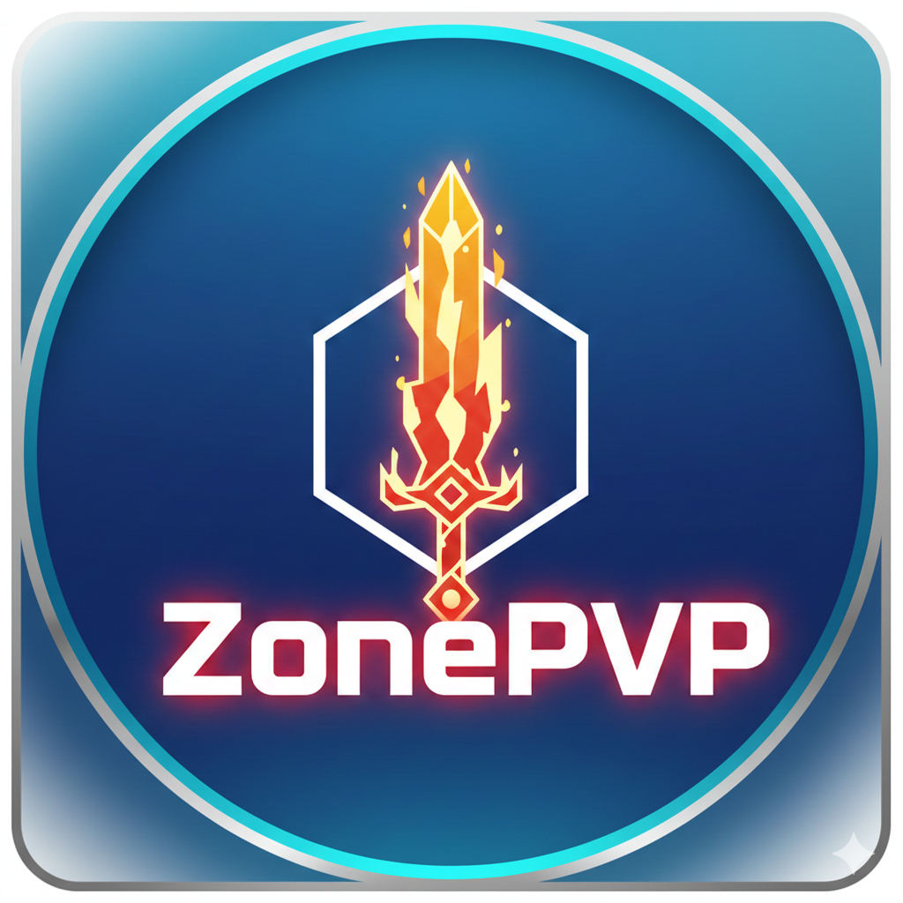
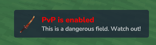
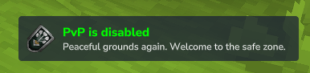

A dynamic PvP management plugin for Hytale that automatically toggles player combat status based on the region they are currently standing in.

## Features

* **Zone-Based Logic:** Automatically detects if a region is a "PvP Zone" based on its name (e.g., Zone1, Zone2).
* **Configurable Thresholds:** Set a minimum "Tier" requirement to trigger PvP.
* **Live Notifications:** Sends immediate feedback to players when they enter or leave dangerous areas.

  

## Configuration

The plugin identifies regions containing the word "Zone" followed by a number. You can control which of these zones allow combat by modifying the configuration file.

**File Path:** ``mods/anonimo_ZonePVP/ZonePVP.json``

### Default Settings
```json
    {
      "MinZone": 2
    }
```

### How it works:
* **MinZone 2:** PvP is ENABLED in Zone2, Zone3, and higher. PvP is DISABLED in Zone1.
* **MinZone 3:** PvP is ENABLED in Zone3, Zone4, and higher. PvP is DISABLED in Zone1 and Zone2.

## Player Experience

ZonePVP keeps players informed about their safety status:

1. Entering a PvP Area: When a player crosses into a region that meets the MinZone requirement, they receive a notification letting them know they are now in a combat zone.
2. Leaving a PvP Area: When moving back into a safe zone or a lower-tier region, they receive a notification that PvP has been disabled.

## Installation

1. Download the latest release.
2. Place the plugin in your Hytale server's mods folder.
3. Restart the server to generate the default ZonePVP.json config.
4. Modify the config to your needs (optional).

## Credits
- Thanks to [Buuz135](https://github.com/Buuz135/) and his [SimpleClaims](https://github.com/Buuz135/SimpleClaims/tree/main) plugin. I've used the damage cancellation logic and the way he shows the titles using game ticks.
- [HytaleModding](https://hytalemodding.dev) website and the awesome documentation. Was really useful to understand how to create a plugin.
